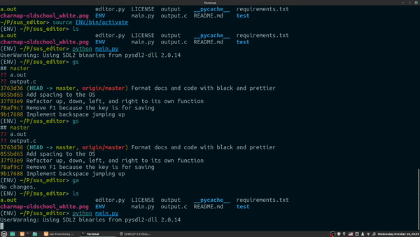

# Sus Editor

# Preview



# Quick Start

## Linux / MacOS / Windows

```console
$ pip3 install -r requirements.txt
$ python3 main.py
```

## Keys

Arrows -> Left, Right, Down, Up

Enter key -> Going to next line

Delete Key -> Deleting character after the cursor

Backspace -> Deleting character before the cursor

Saving a file -> via F1

Only Letters Keyboard input -> Not including F2-F12, Ctrl, Alt, Shift, Caps, Etc

## Inspire

ded editor: https://github.com/tsoding/ded

## Font

domsson: https://opengameart.org/content/ascii-bitmap-font-oldschool
